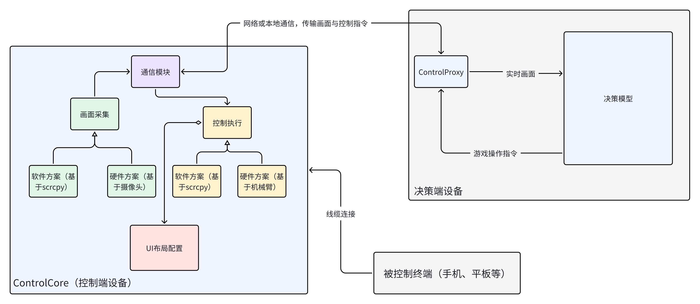
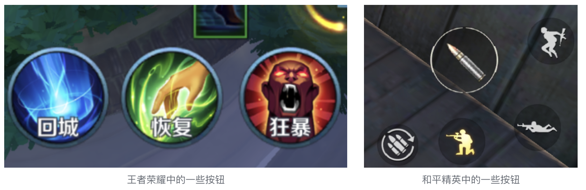
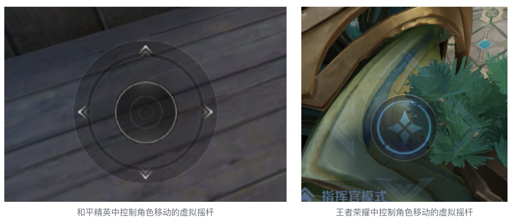
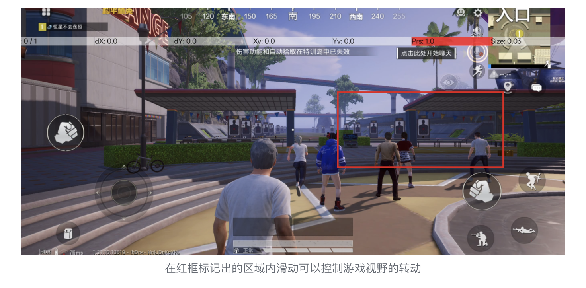

# 整体方案设计

整个系统由被控制终端（用于实际运行游戏的手机、平板等设备）、控制端设备、决策端设备三部分组成，其中控制端与决策端设备可以由两台电脑分别部署，也可以部署在同一台电脑上。

控制端设备捕捉被控制终端的实时画面并传输给决策端，决策端的决策模型根据实时画面产生游戏操作指令并传输至控制端设备，控制端设备将游戏操作指令转换为底层触控操作并在被控制终端执行这些操作。整个系统持续进行上面的过程，从而完成游戏场景自动化操作的目的。

# 控制框架细节

控制框架由ControlCore和ControlProxy两部分组成，ControlProxy实现了与ControlCore的通信逻辑，便于决策模型集成，而无需安装与控制相关的依赖。ControlCore是控制与画面采集的核心模块，主要实现了控制执行、画面采集、UI布局配置三个功能。其中画面采集目前实现了基于scrcpy框架的软件采集逻辑，以及基于摄像头的硬件采集逻辑；控制执行目前实现了基于scrcpy框架的控制方案。

画面采集与控制执行两部分相互独立，UI布局配置为控制执行模块定义了能执行的动作以及游戏操控UI组件在屏幕上的位置。

## UI布局配置

框架将游戏中的操控抽象为三种控件：按钮、虚拟摇杆、自由滑动区域。UI布局配置存储了控件在屏幕上的位置和范围，框架收到相关控件的控制指令时根据UI布局配置信息确定操作的坐标和底层指令。

- 按钮：在一个指定的坐标执行点击或长按，例如王者荣耀中的释放技能按钮、和平精英中的开火按钮、原神中的跳跃按钮

- 虚拟摇杆：屏幕上的一个圆形，可以由圆心坐标和圆周坐标两个点定义，操作时一般通过滑动摇杆来控制角色移动，通过圆周运动控制方向，例如和平精英和王者荣耀控制角色移动都是通过虚拟摇杆完成

- 自由滑动区域：可以抽象为屏幕上的一个矩形区域，在该区域内可以通过手指的自由滑动实现一些游戏操作，常见于动作或射击游戏中的角色视野控制，在一个区域内向某个方向滑动即可控制视野向该方向旋转，例如和平精英和原神旋转游戏视野

## 控制执行

控制执行模块接受一个动作序列（例如[向前移动->向右转视角->开火]），并基于UI布局配置中的定义将动作翻译成底层的手指按下、抬起、移动三种原子操作。
目前，控制框架为每个控件分配一个独立的手指，基于scrcpy框架允许注入多指操控的特性，执行游戏操作时允许多个手指同时操作，从而满足游戏的操作要求（例如一边控制角色移动一边旋转视角）

## 画面采集
框架实现了两种画面采集方案，分别基于scrcpy框架和外部摄像头硬件。scrcpy框架捕捉到的画面优势在于清晰度高、无环境光干扰，外部摄像头硬件的优势在于侵入性低、适配设备范围广。
