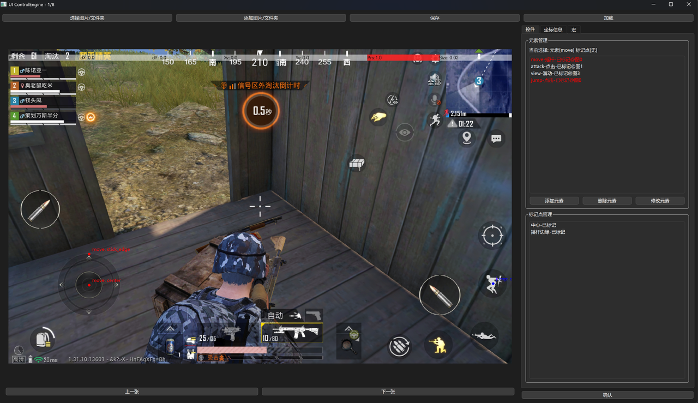
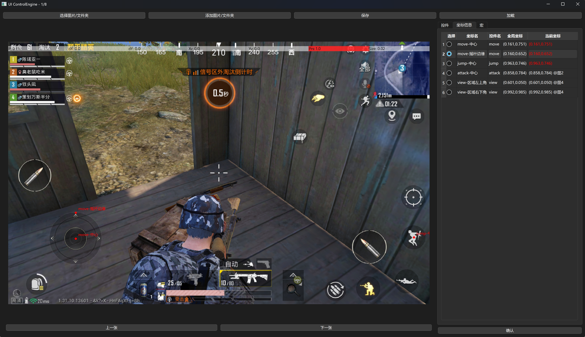
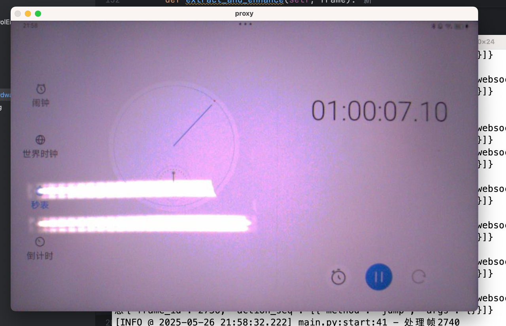

自动化移动游戏测试的核心有两个部分：画面理解、游戏控制。他们各自需要一些辅助工具来进行准备工作，游戏控制需要对游戏画面中的控件进行标注，画面理解需要对摄像头画面进行校准，裁剪冗余信息。

## 界面标注工具
基于对游戏画面中三种基本操作的抽象：：按钮、虚拟摇杆、自由滑动区域。我们设计了一种界面标注的辅助工具，他可以基于输入的游戏画面，对三种基础控件进行标注，并将UI布局配置存储到json文件中，文件信息包括控件在屏幕上的位置和范围等。框架收到相关控件的控制指令时根据UI布局配置信息就能确定操作的坐标和底层指令。

由于游戏中的特定UI按钮在特定情况下才会出现，因此，需要多张图片才能完整描述游戏的所有操控。对此，我们添加了多图片同时标注的功能，能够对同一个游戏的多张图片进行标注，然后生成一个能够描述完整控件的json文件（座标颜色为红色表示该坐标标注在当前显示的图片中）：

## 画面校准工具
当前的自动化移动游戏测试通过摄像头获取游戏画面，从画面中提取屏幕画面。因此需要裁切掉屏幕之外的部分，避免拍摄到的其他元素给决策模型带来干扰，并修正因为摆放问题导致的画面倾斜，提高框架运行的稳定性。因此我们设计了画面校准工具对摄像头画面进行校准，裁剪冗余信息。目前采用边缘检测算法处理画面，提取出画面中的最大区域作为屏幕边界。在第一帧检测屏幕四角并记录，后面每一帧直接基于屏幕四角进行图像透视变换得到屏幕内容，避免带来延迟增长。

我们增加了设备自动解锁的功能，避免操作时设备锁屏导致无法操作。同时为了排除画面内容对边缘检测的影响，画面校准工具首先会启动一个APP，使得移动设备全屏显示白色，然后再进行边缘检测找到画面中最大的矩形轮廓，从而获得屏幕边界位置，完成画面标准后，再关闭全屏白色APP，显示游戏画面，后续传输画面时自动进行裁切和透视转换，演示效果如下：
<video controls src="showcase_clip.mp4" title="Title"></video>