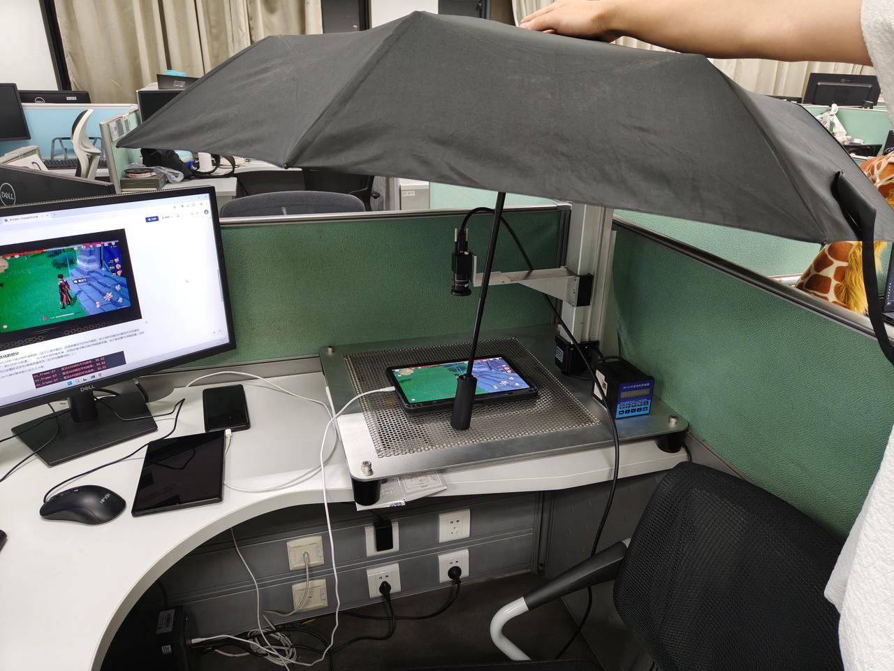

## 测试平台搭建
测试平台通过前端外接摄像头采集移动设备画面，经由网络发给决策端；决策端根据画面信息做出决策发送给前端；最终前端接受动作指令并控制移动设备进行游戏。

<video controls src="platform.mp4" title="Title"></video>

## 游戏演示
下面两个视频展示了本非侵入式自动化移动游戏测试框架中控制端与决策端协同工作的效果，以原神为例展示了自动战斗和自动寻路。所有操作均由决策模型基于实时画面决策产生。
注：该部分的画面采集与操作执行均借助scrcpy框架实现。基于摄像头画面的决策还在优化中......
<video controls src="game1.mp4" title="Title"></video>
<video controls src="game2.mp4" title="Title"></video>